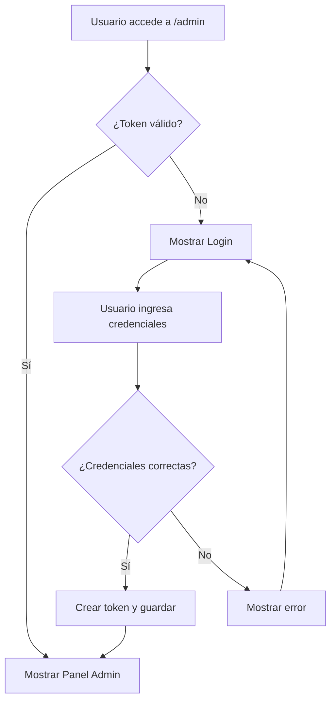

# Sistema de Autenticación - Panel de Administración

## 🔐 Descripción

Sistema de autenticación básico pero funcional para proteger el panel de administración de ConstruMax.

## ✨ Características

### Autenticación

- ✅ **Login seguro** con usuario y contraseña
- ✅ **Tokens de sesión** con expiración (24 horas)
- ✅ **Persistencia de sesión** en localStorage
- ✅ **Logout automático** al expirar el token
- ✅ **Protección de rutas** del panel admin

### Seguridad

- ✅ **Validación de credenciales** en el frontend
- ✅ **Tokens con expiración** automática
- ✅ **Protección de componentes** con ProtectedRoute
- ✅ **Limpieza automática** de tokens expirados

### Experiencia de Usuario

- ✅ **Interfaz intuitiva** de login
- ✅ **Mostrar/ocultar contraseña**
- ✅ **Mensajes de error** claros
- ✅ **Estados de carga** durante autenticación
- ✅ **Logout confirmado** para evitar cierres accidentales

## 🚀 Credenciales de Desarrollo

```
Usuario: admin
Contraseña: admin123
```

⚠️ **IMPORTANTE**: Estas credenciales son solo para desarrollo. En producción debes cambiarlas.

## 📁 Estructura de Archivos

```
src/components/admin/
├── AuthProvider.tsx          # Contexto de autenticación
├── AdminLogin.tsx           # Componente de login
└── ProtectedRoute.tsx       # Protección de rutas

src/lib/
└── auth.ts                  # Utilidades de autenticación

src/app/admin/
└── layout.tsx              # Layout con autenticación
```

## 🔧 Configuración

### Variables de Entorno

Crea un archivo `.env.local` con:

```env
NEXT_PUBLIC_ADMIN_USERNAME=admin
NEXT_PUBLIC_ADMIN_PASSWORD=admin123
```

### Para Producción

```env
NEXT_PUBLIC_ADMIN_USERNAME=tu_usuario_seguro
NEXT_PUBLIC_ADMIN_PASSWORD=tu_contraseña_muy_segura_123456
ADMIN_SECRET_KEY=tu_clave_secreta_para_firmar_tokens_jwt
```

## 🛡️ Funcionamiento

### 1. Flujo de Autenticación



### 2. Protección de Rutas

Todas las páginas del admin están protegidas por `ProtectedRoute`:

```tsx
// En layout.tsx
<AuthProvider>
  <ProtectedRoute>{children}</ProtectedRoute>
</AuthProvider>
```

### 3. Token de Sesión

```javascript
// Estructura del token
{
  username: "admin",
  exp: 1692612000000, // 24 horas desde creación
  role: "admin"
}
```

## 🎯 Uso

### Acceder al Panel

1. **Ir a** `/admin` en tu navegador
2. **Ingresar credenciales**:
   - Usuario: `admin`
   - Contraseña: `admin123`
3. **Hacer clic** en "Iniciar Sesión"

### Cerrar Sesión

1. **En el sidebar** del panel admin
2. **Hacer clic** en "Cerrar Sesión"
3. **Confirmar** en el diálogo

### Sesión Automática

- **Duración**: 24 horas
- **Renovación**: Manual (nuevo login)
- **Expiración**: Automática con redirección a login

## 🔒 Seguridad en Producción

### ⚠️ Configuraciones Requeridas

1. **Credenciales Seguras**:

   ```env
   NEXT_PUBLIC_ADMIN_USERNAME=admin_usuario_complejo
   NEXT_PUBLIC_ADMIN_PASSWORD=ContraseñaSuperSegura123!@#
   ```

2. **HTTPS Obligatorio**:

   - Certificado SSL válido
   - Redirección automática HTTP → HTTPS

3. **Tokens JWT Reales**:

   ```javascript
   // Reemplazar en AuthProvider.tsx
   import jwt from "jsonwebtoken";

   const token = jwt.sign(
     { username, role: "admin" },
     process.env.ADMIN_SECRET_KEY,
     { expiresIn: "24h" }
   );
   ```

4. **Validación Backend**:

   ```javascript
   // En auth.ts - descomentar para producción
   if (!verifyAdminToken(request)) {
     return new Response(JSON.stringify({ error: "No autorizado" }), {
       status: 401,
     });
   }
   ```

5. **Rate Limiting**:
   - Limitar intentos de login
   - Bloqueo temporal por IP
   - Captcha después de varios intentos

### 🚨 Vulnerabilidades Actuales (Solo Desarrollo)

- ❌ Credenciales en variables de entorno públicas
- ❌ Tokens simples (no JWT reales)
- ❌ Sin rate limiting
- ❌ Sin validación backend estricta
- ❌ Sin auditoria de accesos

## 🔄 Mejoras Futuras

### Funcionalidades Pendientes

- [ ] **Multiple roles** (admin, moderador, etc.)
- [ ] **Two-factor authentication** (2FA)
- [ ] **Recuperación de contraseña**
- [ ] **Gestión de usuarios admin**
- [ ] **Historial de accesos**
- [ ] **Sesiones múltiples** con invalidación
- [ ] **OAuth integration** (Google, GitHub)

### Mejoras de Seguridad

- [ ] **JWT tokens reales** con refresh tokens
- [ ] **Validación backend** en todas las APIs
- [ ] **Rate limiting** en endpoints
- [ ] **Audit logging** de acciones admin
- [ ] **IP whitelisting** opcional
- [ ] **Session timeout** configurable

## 🆘 Troubleshooting

### Problemas Comunes

1. **No puedo acceder al admin**:

   - Verificar credenciales en `.env.local`
   - Limpiar localStorage: `localStorage.clear()`
   - Verificar que el servidor esté corriendo

2. **Sesión expira inmediatamente**:

   - Verificar hora del sistema
   - Limpiar localStorage y reintentar

3. **Error de autenticación en APIs**:
   - Verificar que el token se esté enviando
   - Revisar configuración de CORS

### Debug Mode

```javascript
// En AuthProvider.tsx, agregar logs
console.log("Token data:", tokenData);
console.log("Current time:", Date.now());
console.log("Token expiry:", tokenData.exp);
```

---

**Autenticación v1.0 - Desarrollado para ConstruMax Panel Admin**

_¡Tu panel de administración ahora está protegido! 🔐_
